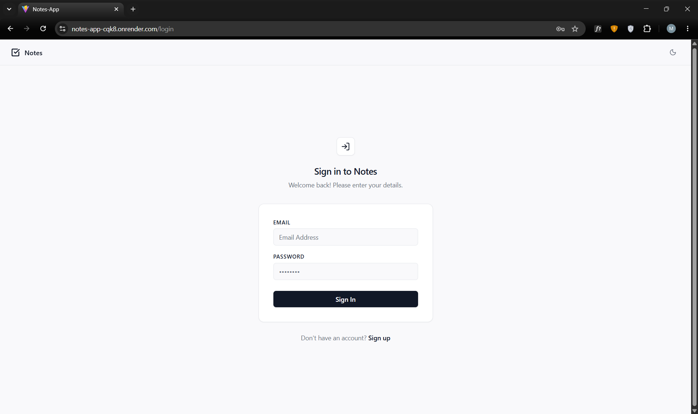
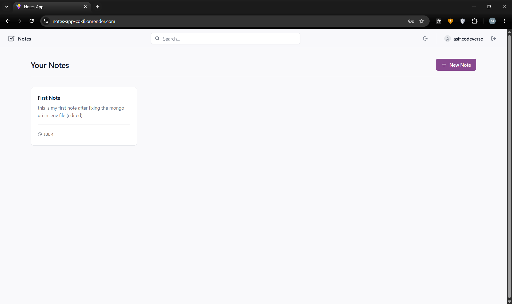
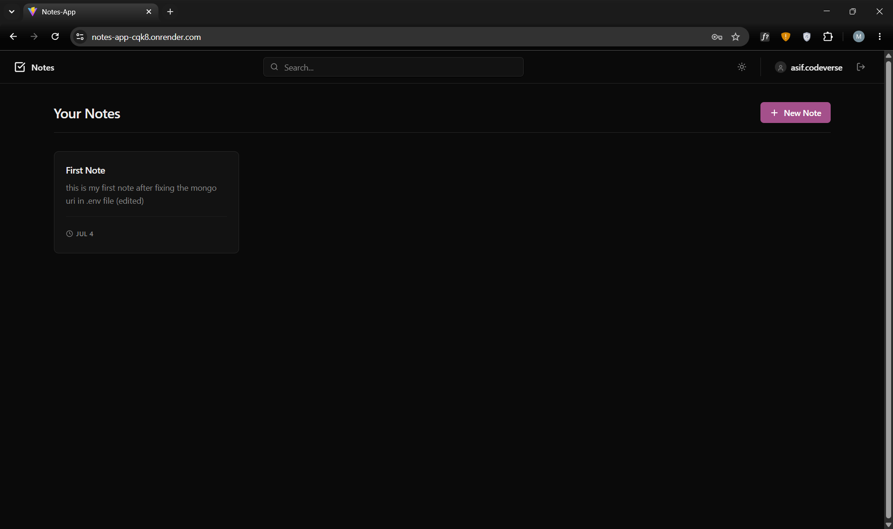
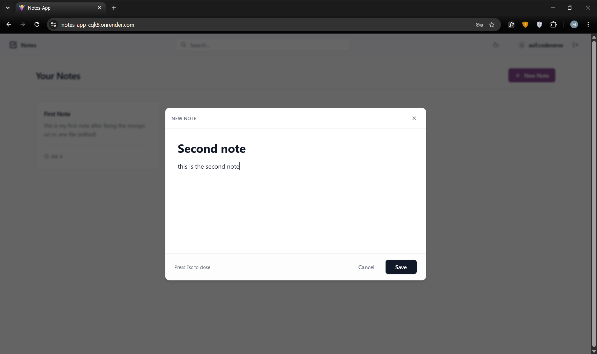
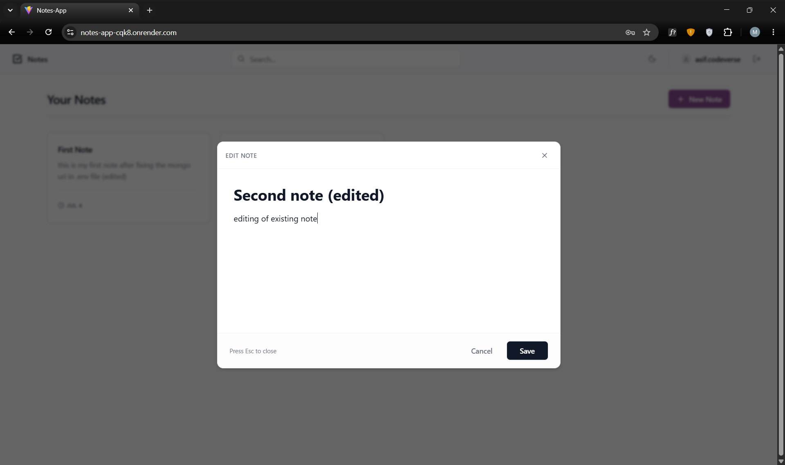
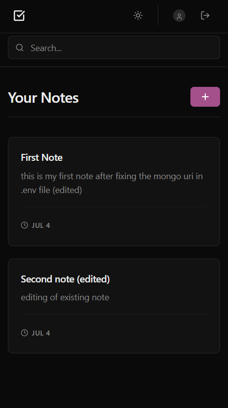
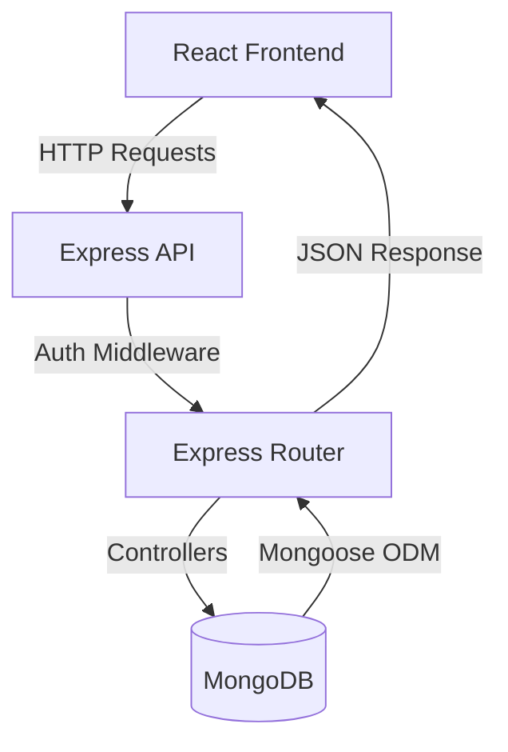

<div align="center">

# 📝 Notes Application

[](https://reactjs.org/)
[](https://nodejs.org/)
[](https://www.mongodb.com/)
[](https://tailwindcss.com/)
[](https://vitejs.dev/)
[](#license)

A modern, responsive, and secure full-stack web application for creating, managing, and organizing your personal notes. Built with the MERN stack and styled with Tailwind CSS.

[Explore the Docs](#api-documentation) · [Report Bug](#issues) · [Request Feature](#issues)

</div>

---

## 📖 Project Overview

The Notes Application is a full-stack MERN (MongoDB, Express, React, Node.js) project designed to provide users with a seamless and intuitive note-taking experience. 

**Why it exists:** To demonstrate a production-ready approach to building secure CRUD applications with robust authentication, clean architecture, and modern UI practices.
**Target Users:** Individuals seeking a simple, fast, and visually appealing way to manage their daily notes and thoughts securely.
**Main Capabilities:** Secure user authentication (JWT), dynamic note management (Create, Read, Update, Delete), and a highly responsive design with theming support.

---

## 🚀 Live Demo

🌐 **Live Application:**  
[Open Notes App](https://notes-app-cqk8.onrender.com)

---

## 📸 Screenshots

| Login / Register | Dashboard (Light) | Dashboard (Dark) |
| :---: | :---: | :---: |
|  |  |  |

| Create Note | Edit Note | Mobile View |
| :---: | :---: | :---: |
|  |  |  |

---

## ✨ Features

### Authentication
* **Secure Registration:** User account creation with encrypted passwords.
* **Secure Login:** Validated email/password authentication.
* **JWT Authentication:** Stateless session management using JSON Web Tokens.
* **Protected Routes:** Frontend and backend security to prevent unauthorized access.

### Notes Management
* **Create Notes:** Add new notes with titles and detailed descriptions.
* **Edit Notes:** Update existing note content on the fly.
* **Delete Notes:** Remove unwanted notes instantly.
* **View Notes:** Clean grid/list display of all user-specific notes.

### User Experience
* **Responsive Design:** Flawless experience across mobile, tablet, and desktop.
* **Modern UI:** Clean, minimalistic interface built with Tailwind CSS v4.
* **Theme Support:** Context-driven theme system for dynamic styling.
* **Loading States:** Graceful loading indicators using Lucide React icons.

---

## 🛠️ Tech Stack

### Frontend
* **Library:** React 19
* **Routing:** React Router v7
* **HTTP Client:** Axios
* **Icons:** Lucide React

### Backend
* **Runtime:** Node.js
* **Framework:** Express.js
* **Authentication:** JSON Web Tokens (JWT)
* **Encryption:** bcryptjs

### Database
* **Database:** MongoDB
* **ODM:** Mongoose

### Styling
* **Framework:** Tailwind CSS v4

### Development Tools
* **Bundler:** Vite
* **Linter:** ESLint
* **Monitering:** Nodemon

---

## 🏗️ Project Architecture

The application follows a standard client-server architecture.



* **Frontend Responsibilities:** UI rendering, client-side routing, form validation, state management, and managing the JWT token in local storage.
* **Backend Responsibilities:** Exposing RESTful endpoints, validating requests, enforcing authentication/authorization, and processing business logic.
* **Database Responsibilities:** Persistent storage of User credentials and Note documents.

---

## 📁 Folder Structure

```text
c:\vs.code\notes-app\
├── backend/
│   ├── config/
│   │   └── db.js              # Database connection setup
│   ├── middleware/
│   │   └── auth.js            # JWT protection middleware
│   ├── models/
│   │   ├── Note.js            # Mongoose Note Schema
│   │   └── User.js            # Mongoose User Schema
│   ├── routes/
│   │   ├── auth.js            # Authentication endpoints
│   │   └── notes.js           # CRUD endpoints for notes
│   └── server.js              # Express entry point
├── frontend/
│   ├── src/
│   │   ├── assets/            # Static assets
│   │   ├── components/        # React components (Home, Login, Navbar, etc.)
│   │   ├── App.jsx            # Main React component & Routing
│   │   ├── index.css          # Tailwind entry & global styles
│   │   └── main.jsx           # React DOM rendering entry
│   ├── package.json           # Frontend dependencies
│   └── vite.config.js         # Vite configuration & API Proxy
├── package.json               # Root dependencies & concurrent scripts
└── README.md                  # Project Documentation
```

---

## 🔐 Authentication Flow

1. **Registration:** User submits credentials -> Backend hashes password (bcrypt) -> Saves to MongoDB -> Returns JWT.
2. **Login:** User submits credentials -> Backend verifies hash -> Returns JWT.
3. **Session:** Frontend stores JWT in `localStorage` -> Attaches to `Authorization: Bearer <token>` header for subsequent Axios requests.
4. **Validation:** Backend `auth.js` middleware intercepts protected routes -> Verifies JWT -> Attaches `req.user` -> Proceeds to controller.

---

## 📡 API Documentation

### Auth Routes (`/api/users`)

| Method | Route | Auth Required | Description |
| :--- | :--- | :---: | :--- |
| `POST` | `/register` | No | Register a new user. Expects `username`, `email`, `password`. |
| `POST` | `/login` | No | Authenticate user. Expects `email`, `password`. |
| `GET` | `/me` | Yes | Get the currently authenticated user's profile data. |

### Note Routes (`/api/notes`)

| Method | Route | Auth Required | Description |
| :--- | :--- | :---: | :--- |
| `GET` | `/` | Yes | Fetch all notes belonging to the authenticated user. |
| `POST` | `/` | Yes | Create a new note. Expects `title`, `description`. |
| `GET` | `/:id` | Yes | Fetch a specific note by ID. |
| `PUT` | `/:id` | Yes | Update an existing note by ID. Expects `title`, `description`. |
| `DELETE` | `/:id` | Yes | Delete a note by ID. |

---

## 💻 Installation

### Prerequisites
* Node.js (v18+ recommended)
* MongoDB Database (Local or MongoDB Atlas)

### Setup Guide

1. **Clone the repository:**
   ```bash
   git clone <repository_url>
   cd notes-app
   ```

2. **Install Root Dependencies:**
   ```bash
   npm install
   ```

3. **Install Frontend Dependencies:**
   ```bash
   cd frontend
   npm install
   cd ..
   ```

4. **Environment Variables:**
   Create a `.env` file in the `backend` directory (or project root, based on setup) and add:
   ```env
   PORT=5000
   MONGODB_URI=your_mongodb_connection_string
   JWT_SECRET=your_super_secret_jwt_key
   ```

5. **Run Locally (Development):**
   Start both the backend server and frontend Vite server concurrently:
   ```bash
   # Terminal 1 (Backend)
   npm run dev

   # Terminal 2 (Frontend)
   cd frontend
   npm run dev
   ```

6. **Production Build:**
   ```bash
   npm run build
   npm run start
   ```

---

## ⚙️ Environment Variables

| Variable | Location | Description |
| :--- | :--- | :--- |
| `PORT` | Backend | Port number for the Express server (Default: 5000) |
| `MONGODB_URI` | Backend | Connection string for MongoDB |
| `JWT_SECRET` | Backend | Secret key used for signing JSON Web Tokens |

*(Note: Frontend uses Vite's proxy in development to route `/api` to `localhost:5000`. No `.env` is strictly required for the frontend in local dev.)*

---

## 📜 Scripts

### Root `package.json`
* `npm run dev`: Starts the backend server using Nodemon.
* `npm run build`: Installs root/frontend dependencies and builds the React app.
* `npm run start`: Starts the backend server in production mode (serves static frontend files).

### Frontend `package.json`
* `npm run dev`: Starts the Vite development server.
* `npm run build`: Compiles the React application for production.
* `npm run lint`: Runs ESLint for code quality checks.

---

## 📱 Responsive Design

The application is built Mobile-First and utilizes Tailwind CSS utility classes to adapt to various screen sizes:
* **Mobile (<640px):** Single-column layouts, stacked navigation.
* **Tablet (640px - 1024px):** Adjusted padding, grid adaptations.
* **Desktop (>1024px):** Multi-column note grids, expanded UI elements.

---

## 🛡️ Security Features

* **Password Hashing:** Passwords are never stored in plain text. `bcryptjs` is used with a salt round of 10.
* **JWT (JSON Web Tokens):** Stateless authentication prevents session hijacking. Tokens expire after 30 days.
* **Protected Routes:** Express middleware verifies token validity before granting access to CRUD operations.
* **Authorization:** Users can only view, edit, or delete notes that they explicitly created (verified via `req.user._id` matching `note.createdBy`).

---

## ⚡ Performance

* **Vite Bundling:** Extremely fast HMR during development and highly optimized rollup builds for production.
* **Stateless Auth:** JWT removes the need for memory-intensive backend session stores.
* **Optimized Routing:** React Router ensures seamless client-side navigation without full page reloads.

---

## 🚀 Future Improvements

* **Note Categorization:** Add folders or tags to group notes logically.
* **Rich Text Editing:** Integrate a WYSIWYG editor for formatted notes.
* **Search & Filter:** Implement real-time client-side searching and sorting.
* **OAuth Integration:** Allow users to log in via Google or GitHub.

---

## 🤝 Contributing

Contributions are what make the open-source community such an amazing place to learn, inspire, and create. Any contributions you make are **greatly appreciated**.

1. Fork the Project
2. Create your Feature Branch (`git checkout -b feature/AmazingFeature`)
3. Commit your Changes (`git commit -m 'Add some AmazingFeature'`)
4. Push to the Branch (`git push origin feature/AmazingFeature`)
5. Open a Pull Request

---

## 📄 License

Distributed under the MIT License. See `LICENSE` for more information.

*(Placeholder for actual License file)*

---

## ✍️ Author

**Your Name / Organization**
* GitHub: [@asif-codeverse](https://github.com/asif-codeverse)
* LinkedIn: [Mohd Asif](https://www.linkedin.com/in/mohd-asif-011805tz/)
